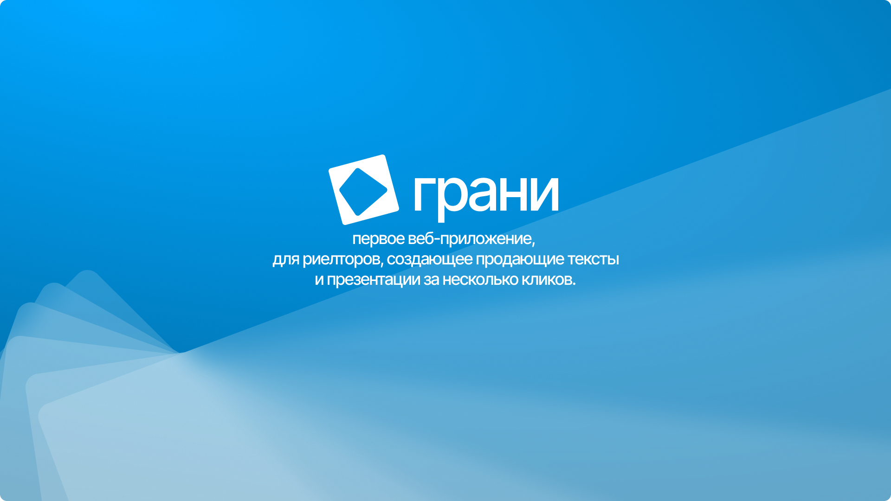

[](https://git.io/typing-svg)

Уникальная презентация для риелтора за пару кликов.

## Содержание
- [Технологии](#технологии)
- [Начало работы](#начало-работы)
- [Contributing](#contributing)
- [To do](#to-do)
- [Как с нами связаться](#Как-с-нами-связаться)

## Технологии
- [Python](https://www.python.org/)
- [JavaScript](https://www.javascript.com/)
- [Nginx](https://nginx.org/)
- [docker](https://www.docker.com/)
- [presentonAi](https://github.com/presenton/presenton)
- [FastAPI](https://fastapi.tiangolo.com/)

## Использование
Запуск проекта:

Склонируйте репозиторий:
```sh
$ git clone https://github.com/snow1x-blip/panorama_uwu-3/
```

создайте .env и добавьте туда следующие данные:
```
Sekret_Key=...
API_Key=...
```

разверните в отдельном докере presenton:
```sh
sudo docker start presenton
```

через uv подгузите зависимости:
```sh
uv lock
```

запустите main.py:
```sh
python main.py
```

## Помощь проекту
Поставьте макс балл пожалуйста 🥰

## FAQ 
Мы всего лишь дети, поэтому как-то так)

### Зачем вы разработали этот проект?
Чтобы был.

## To do
- [x] Разработать архетектуру проекта
- [x] Настроить генерацию презентаций
- [x] Подвязать бек к фронту
- [x] Запумтить в прод
- [ ] ...

## Как с нами связаться:

- [Фомин Тимофей](https://t.me/neutrinoooooo) — Tech-lid/Full-stack
- [Чехов Павел](https://t.me/snow1xx) — Back-end/DevOps
